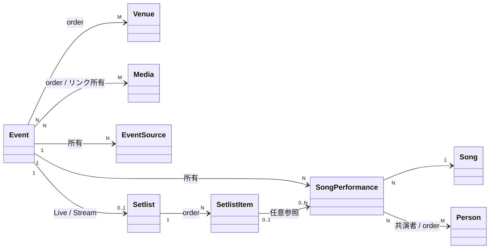

# Event Spec

関連: ADR-0015 (画像)、ADR-0020 (Media)、ADR-0021 (公開 read model)、ADR-0022 (監査)、ADR-0023 (Person)、ADR-0025 (Venue)、ADR-0026 (Event / Activity 境界)、ADR-0027 (Event の日付精度)

## 用語

- **Event (イベント)**: ヰ世界情緒による、または本人が公式に参加する、一回の開催または連続した開催期間
- **Event** の主要フィールド: `eventId` / `title` / `description` / `type` / `schedule` / `status` / `isDisplay`
- **EventType**: Live / Stream / Exhibition / Other。開催方法ではなく Event 全体の主目的を表す
- **EventSchedule**: `startOn` / `endOn` で開催時期を表す。両方 null は日付未定、`startOn` のみは単日、両方指定は期間。`endOn` のみは許容しない。時刻とタイムゾーンは持たず、詳細な時刻は Event の説明に記載する
- **EventStatus**: Normal / Postponed / Cancelled。予定、開催済みを表す値は持たない
- **EventSource**: `displayName` / `url` / `orderNo`。用途を固定 enum で分類しない
- **SongPerformance (楽曲披露)**: 本人が Event 内で一つの Song を一回披露した事実
- **Setlist**: Live または Stream で判明している演目を `orderNo` 順に並べた一覧

## できること

- Admin: Event の検索・取得・作成・更新・削除
  タイトル、活動種別、開催時期、延期・中止、開催先、公開状態で検索できる
- Event はタイトル必須、改行可能なプレーンテキストの説明は空文字を許容する必須値。同じタイトル・日付を許容する
- 一回の開始を一つの Event とする。同日昼夜公演は別 Event、同時刻の現地会場と配信先は一つの Event とする
- 開催先は 0 件以上。Venue / Media / EventSource は Event 内で重複不可かつ `orderNo` を持つ
- EventSource は 0 件でも Event を公開できる。Viewer には表示名と URL を公開する
- Event は複数の Media を関連づけられる。リンクの所有は Event 側
- Postponed の Event は延期先 Event を参照しない。延期後の開催は別 Event として登録する
- SongPerformance はすべての EventType に 0 件以上登録でき、必ず 1 件の Song を参照する
  同じ Event で同じ Song を複数回披露した場合も別 SongPerformance とする
- SongPerformance は一緒に歌唱した Person を共演者として順序付きで参照できる
  演奏だけを担当した Person は含めず、当日のユニット名などを任意のクレジット名として持てる
- Live / Stream は Setlist を持てる。項目は `orderNo` を持ち、次のどちらかまたは両方を満たす
  - 1 件以上の SongPerformance を参照する。メドレーでは複数件を参照できる
  - 本人が歌唱しない演目などを表す表示名を持つ
- SongPerformance は Setlist 項目に属さなくてもよいが、最大 1 項目からだけ参照される
- Setlist は判明分だけ登録でき、完全／一部の区分を持たない
- EventType を Live / Stream から Exhibition / Other へ変える場合、Setlist が残っていれば拒否する
- Postponed / Cancelled の Event は SongPerformance と Setlist を持たない
  状態を Postponed / Cancelled にする保存で SongPerformance または Setlist が残っていれば拒否する
- SongPerformance の公開可否は所属する Event の `isDisplay` に従い、SongPerformance ごとには持たない
- Admin の作成・更新は Venue、EventSource、Media、SongPerformance、Setlist を含む Event 集約全体を原子的に保存する
- `ReadEvent` / `WriteEvent` で操作を認可し、作成・更新・削除を Event 対象で監査記録する
- Viewer: 公開 Event の詳細を含む cursor 一覧。個別 get は持たない
  SSG は一覧からイベント詳細ページを生成し、イベント一覧、ホームの今後の予定、Song の披露履歴から辿れる
- Viewer のイベント一覧は、日付未定を先頭の別枠に置き、残りは未来・過去を区別せず年ごとに開催日の降順で表示する
  イベント種別で絞り込み、タイトル・年・開催先でクライアント側検索できる。延期・中止も元の開催日の位置に状態バッジ付きで残す
- ホームの今後の予定は、延期・中止を除外したうえでブラウザ上の現在日付と比較して導出する
- 公開 Event が非公開 Song を参照する場合、イベント詳細には曲名だけを出し、Song ID とリンクは出さない
  非公開 Media はイベント詳細から除外する

## できないこと

- Activity 集約や共通テーブルを導入せず、Event / Release / Media を独立した集約として維持する
- Event の予定／開催済み状態を永続化しない。現在日時を理由に状態を自動更新しない
- Event の時刻やタイムゾーンを構造化データとして保存しない。必要な時刻情報は説明に記載する
- EventSeries、主催者、Event 単位の出演者、団体マスタを持たない
- Setlist を Exhibition / Other に持たせない
- 共演者に演奏者を含めない。本人が歌唱しない演目を SongPerformance にしない
- EventSource の用途分類、本文、画像を保存しない
- 権利者画像を保存・配信しない
- 初期スコープで Discord 公開通知や開催前リマインドを行わない
- 参照中の Song / Person / Venue / Media は削除できない
- Event の公開状態は削除可否に影響しない。別 Event などからの FK 参照がなければ削除でき、所有する子要素は同時に削除する

## 主な関係

