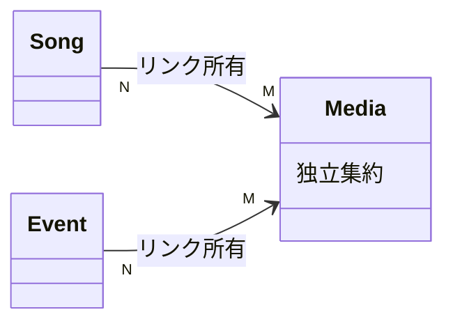

# Media Spec

関連: ADR-0015 (画像)、ADR-0020 (6 フィールドと MediaType)

## 用語

- **Media** の永続フィールドは次のみ: `mediaId` / `title` / `url` / `publishedAt` / `isDisplay` / `type`
- **MediaType** (1 軸): Mv / AudioVideo / LiveStream / Short / Post / Other
  入力経路の未知 type は Other に倒す
- `url` は一意。platform / thumbnail / 旧 format は永続しない

## できること

- Admin: Media の検索・取得・作成・更新・削除。参照している楽曲の確認
- Viewer: 公開 Media の cursor 一覧 (個別 get は持たない)
  item に関連する公開 Song 要約が載る。バッジや YouTube サムネは `url` から viewer が導出する
- CLI からの YouTube 取込経路がある (管理 UI の CRUD とは別)

## できないこと

- platform / thumbnail を DB・契約・Admin API に持たない
- 権利者画像を自前ホストしない。YouTube サムネはプラットフォーム CDN の直参照のみ
- 楽曲または Event に紐づいている Media は削除できない
- Viewer に `isDisplay` を出さない

## 主な関係

