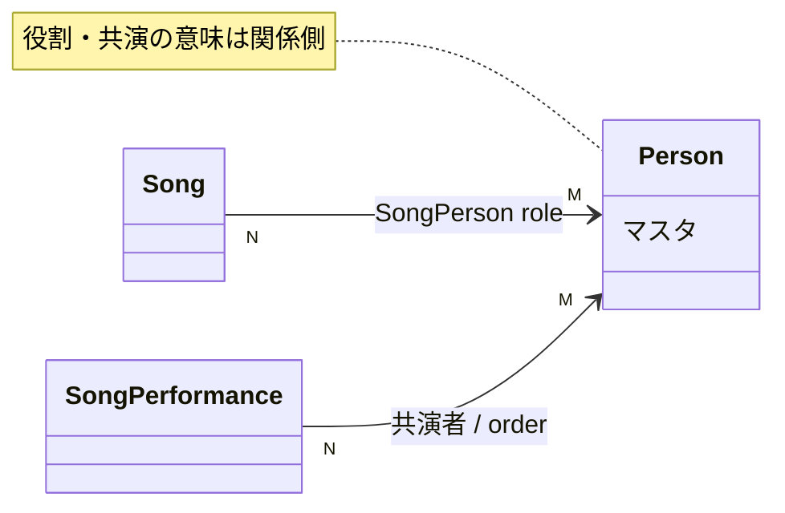

# Person Spec

関連: ADR-0023

## 用語

- **Person**: `personId` / `name` (一意) / `orderNo`。役割マスタではない
- 楽曲上の役割は **SongPersonRole**: Lyricist / Composer / Arranger (song 文脈のみ)
- Creator / Performer 互換は持たない。管理導線は `/persons` のみ

## できること

- Admin: Person の一覧・検索・取得・作成・更新・削除
- Admin: 楽曲編集で人物を role + order 付きで添付できる
  同一人物を別 role で複数付けられる。同一 person+role の重複は不可
- Admin: Event の楽曲披露で、本人と一緒に歌唱した人物を順序付きの共演者として添付できる
- Viewer: 人物 API・人物ページは持たない
  楽曲 item 上の名前配列 (lyricists / composers / arrangers) または楽曲披露の共演者名としてのみ見える

## できないこと

- Person 単体に role を持たせない
- Person 単体に Vocalist / Performer などの役割を持たせない。楽曲披露との共演関係自体が意味を持つ
- 楽曲または楽曲披露で使用中の Person は削除できない
- Viewer から人物マスタを辿れない

## 主な関係

