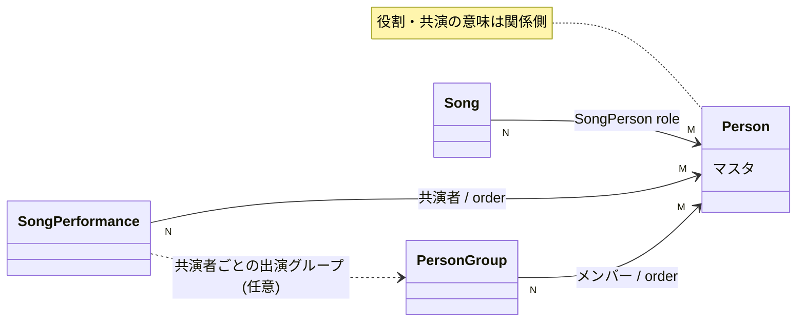

# Person Spec

関連: ADR-0023, ADR-0029

## 用語

- **Person**: `personId` / `name` (一意) / `orderNo`。役割マスタではない
- 楽曲上の役割は **SongPersonRole**: Lyricist / Composer / Arranger (song 文脈のみ)
- Creator / Performer 互換は持たない。管理導線は `/persons` のみ
- **PersonGroup**: `personGroupId` / `name` (一意) / 順序付きのメンバー (Person)。共演者をまとめて入力・表示するためのグループで、所属期間は持たない

## できること

- Admin: Person の一覧・検索・取得・作成・更新・削除
- Admin: 楽曲編集で人物を role + order 付きで添付できる
  同一人物を別 role で複数付けられる。同一 person+role の重複は不可
- Admin: Event の楽曲披露で、本人と一緒に歌唱した人物を順序付きの共演者として添付できる
- Admin: PersonGroup の検索・取得・作成・更新・削除 (`/person-groups`)。認可は Person と同じ `ReadPerson` / `WritePerson`
  メンバーは 0 人以上で重複不可。本人はメンバーに登録しない運用とする
- Admin: 楽曲披露でグループを選ぶと、メンバーをグループ付きの共演者としてまとめて添付できる
- Viewer: 人物 API・人物ページは持たない
  楽曲 item 上の名前配列 (lyricists / composers / arrangers) または楽曲披露の共演者名としてのみ見える
  グループとして出演した共演者は、グループ名 1 つにまとめて見える

## できないこと

- Person 単体に role を持たせない
- Person 単体に Vocalist / Performer などの役割を持たせない。楽曲披露との共演関係自体が意味を持つ
- 楽曲または楽曲披露で使用中の Person は削除できない。PersonGroup のメンバーであることは削除を妨げず、所属は同時に外れる
- 楽曲披露から参照中の PersonGroup は削除できない
- 楽曲披露の記録にグループ参照だけを保存しない。共演者は常に Person 単位で残す
- Viewer から人物マスタを辿れない

## 主な関係

```mermaid
classDiagram
  direction LR
  class Person {
    マスタ
  }
  Song "N" --> "M" Person : SongPerson role
  SongPerformance "N" --> "M" Person : 共演者 / order
  PersonGroup "N" --> "M" Person : メンバー / order
  SongPerformance ..> PersonGroup : 共演者ごとの出演グループ (任意)
  note for Person "役割・共演の意味は関係側"
```
