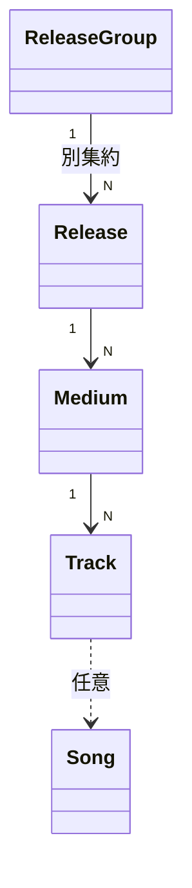

# Release Spec

関連: ADR-0015 (画像と代表色)、ADR-0019 (階層と formats)

## 用語

- **ReleaseGroup** (作品): `releaseGroupId` / `title` / `type` (Single / Album / Ep / Other) / `description` / `isDisplay` / `orderNo`
- **Release** (版): `releaseId` / 所属 Group / `name` (空可) / `releasedOn` / `description` / `color` (`#rrggbb`) / `isDisplay` / `orderNo` / `formats` (非空集合)
- **Medium** (トラックリストの区切り): `position` / `name?` / `tracks[]`
  契約上のフィールド名は `media` だが、Media パッケージの Media とは別物
- **Track**: `songId?` + `title?` (少なくとも一方必須) + `trackNo`
  Song 参照トラックは表示名を `title` で上書きできる。タイトルのみの行は Song 非参照
- **ReleaseFormat**: Digital / Cd / Dvd / BluRay / Other。順序なし集合。Medium には載せない
- 代表色は Release が持つ。Group の見た目用色は傘下の公開版から導出する (永続しない)

## できること

- Admin: ReleaseGroup / Release の CRUD。一覧・検索の主語は ReleaseGroup
- Admin: Event のセットリスト順に楽曲披露を Track として取り込める
  セットリスト外の楽曲披露は末尾に並べ、表示名だけの項目はタイトルのみの Track として選んだときだけ取り込む
- Admin: 版の代表色を手入力する。またはローカル画像からブラウザ内で抽出して人が選ぶ (画像はサーバへ送らない)
- Viewer: 公開 Group の cursor 一覧 (ネストで公開 Release / Medium / Track)
  公開 Release を 1 件以上持つ Group のみ返す

## できないこと

- ジャケットなど権利者画像を保存・配信しない。色は単色のみ
- formats を空にできない。Medium に format を持たせない
- 傘下 Release がある ReleaseGroup は削除できない
- Event から関連リリースとして参照されている Release は削除できない (Event 側がリンクを所有する。`event.md` 参照)
- Viewer に個別 get や `isDisplay` を出さない

## 主な関係

