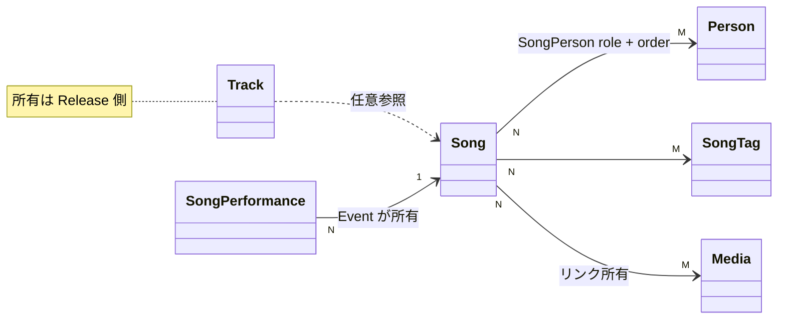

# Song Spec

## 用語

- **Song**: `songId` / `title` / `description` / `lyricsLink?` / `type` (Original / Cover) / `isDisplay` / `orderNo`
- **SongPerson**: `personId` + `role` (Lyricist / Composer / Arranger) + `orderNo`
- **SongTag**: `songTagId` / `name` (一意) / `orderNo`。楽曲への添付はタグ ID 参照
- **SongMediaLink**: `mediaId` + `orderNo`。リンクの所有は Song 側
- **SongPerformance**: Event 内で本人が Song を一回披露した事実。リンクの所有は Event 側

## できること

- Admin: 楽曲の検索・取得・作成・更新・削除。人物・タグ・Media を同時に紐付けられる
- Admin: SongTag の一覧・検索・取得・作成・更新・削除
- Viewer: 公開楽曲の cursor 一覧 (個別 get は持たない)
  item には説明・種別・作詞/作曲/編曲の名前・紐づく公開 Media・収録先の公開 ReleaseGroup 要約・公開 Event での披露履歴が載る
  非公開 Event の SongPerformance は披露履歴に件数も含めて出さない

## できないこと

- Viewer にタグ・`lyricsLink`・`isDisplay`・管理用 shape を出さない
- 人物役割は song 文脈の Lyricist / Composer / Arranger のみ。Creator / Performer 互換は持たない
- 収録トラックまたは SongPerformance から参照されている楽曲は削除できない
- 非公開 Song が公開 Event から参照されても、Viewer の Song 一覧・ページは公開しない
  Event 側には曲名だけを出し、Song ID とリンクは出さない

## 主な関係

