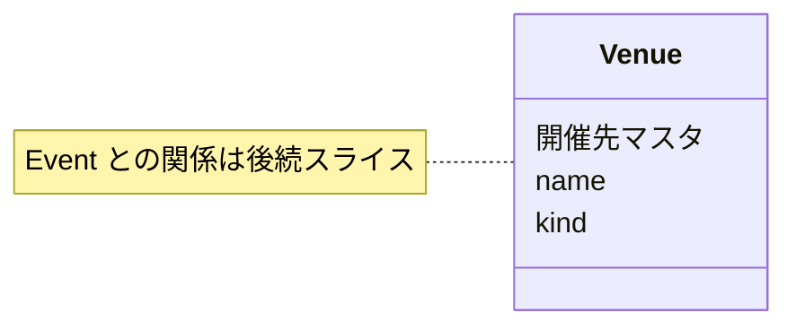

# Venue Spec

関連: ADR-0025

## 用語

- **Venue (開催先)**: 催しや配信が現地開催またはオンライン配信される、再利用可能な施設またはプラットフォーム
- **VenueKind**: 数値 enum。`1` = Physical (現地)、`2` = Online (オンライン)
- Venue の永続フィールドは `venueId` / `name` / `kind` のみ

## できること

- Admin: Venue の検索・取得・作成・更新・削除
- Admin: 名前の部分一致検索、種別の絞り込み、名前の昇順・降順ソート、ページング
- 名前と種別は登録後も変更できる。変更履歴は持たず、常に現在名を使う
- 同種別・同名の Venue も登録できる
- 名前は前後の空白を除去し、NFC 正規化して保存する。1〜255文字とし、改行・制御文字を許容しない
- 正規化後名の比較は大文字小文字を区別しない。保存値は入力の大文字小文字を保つ
- 未使用の Venue は削除できる。存在しない Venue の削除は 404 とする
- `ReadVenue` / `WriteVenue` で操作を認可し、作成・更新・削除は Venue を対象に監査記録する

## できないこと

- 無制限の全件取得 API は持たない
- 名前の重複を API や DB の一意制約で禁止しない
- 住所、公式サイト URL、説明、運営者、利用終了状態、改称履歴は持たない
- Event 固有の視聴・チケット URL は Venue に持たない
- Viewer に Venue API や画面を持たない
- 利用終了した Venue を選択候補から除外しない。過去の Event も後から登録できるよう、状態・警告・選択制限は設けない
- 既存 General ユーザーに Venue 権限を自動付与しない

## 主な関係

